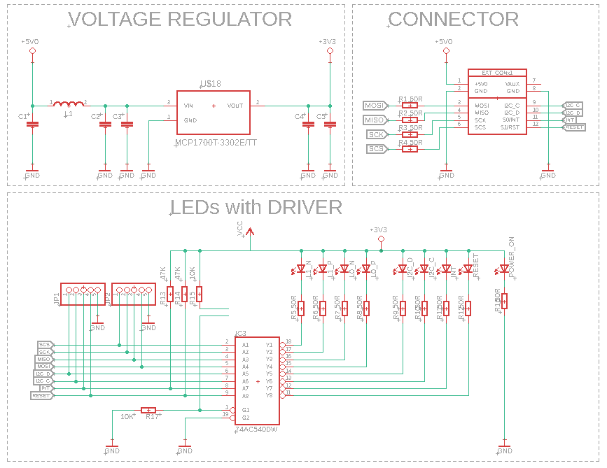
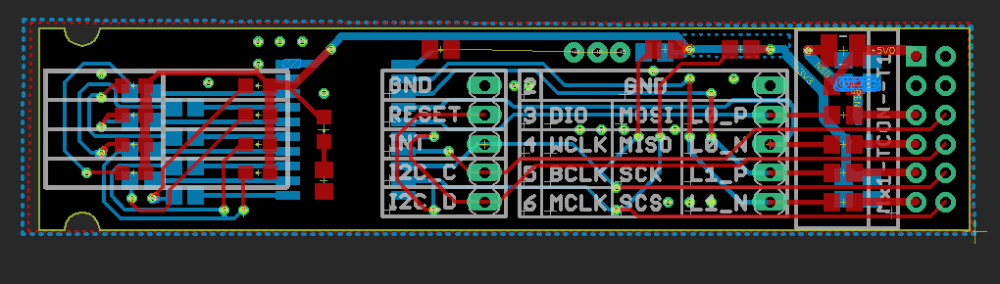

# # Expansion Module: Test Pads with LEDs

## Overview

This repository is dedicated to the design and implementation of the Test Pads with LEDs Expansion Module, an advanced diagnostic tool crafted to enhance the testing and debugging processes of electronic circuits. With its integration of 8 test pads linked to LED indicators and an additional LED for power status verification, this module stands as a critical asset for developers. It excels in facilitating the examination of signal integrity within FPGA configurations on SmartBoard connectors, especially useful in identifying potential line damage caused by the integration of improperly designed expansion modules. Moreover, its utility extends to the observation and testing of signal outputs from the FPGA to external analysis equipment, such as oscilloscopes or logic analyzers, making it invaluable for real-time signal monitoring during module communication interface testing.

## Key Features
LED Indicators: Features 8 LEDs associated with test pads for immediate visual feedback on signal status, plus one additional LED to confirm power supply integrity.
Dual Functionality:
Enables the testing of signal paths on FPGA pads within SmartBoard connectors, aiding in the quick identification of any damaged lines due to faulty expansion module connections.
Facilitates the external monitoring and testing of FPGA output signals, allowing for the rerouting of internal signals to this module for analysis with oscilloscopes or logic analyzers.
Versatile Testing Capability: Specially designed for a broad spectrum of electronic testing and debugging scenarios, enhancing both prototype development and troubleshooting efforts.

## Design Documentation

### Schematic Diagram

*This schematic diagram outlines the layout and connections of the test pads and LEDs, providing a clear guide for replication or modification.*

### Board Design - 2D

*The 2D board design illustrates the placement of LEDs and test pads on the PCB, ensuring optimal accessibility for testing purposes.*

### Board Design - 3D Visualization

*A 3D visualization of the module, offering a comprehensive view of its design and how it can be integrated into existing projects.*

## Contributions and Feedback
We welcome contributions and suggestions for improvements to this module. If you have developed enhancements or have ideas for additional features, please fork the repository, implement your changes, and submit a pull request. For any questions or issues, open an issue in the GitHub repository.

## License
This expansion module is licensed under the MIT License, providing flexibility for both private and commercial use under the following terms:

- **Permission to Use**: Freedom to use, modify, and distribute the module design.
- **Attribution**: While not mandatory, crediting the original author, Adam Łuczak, is appreciated.
- **No Warranty**: Provided "as is", without any warranty; use at your own risk.
- **Liability**: The author bears no liability for any damages or losses.

For full license terms, please refer to the MIT License documentation in this repository.

## Contact
For inquiries or suggestions regarding this project, please contact Adam Łuczak at adam.luczak@outlook.com.
